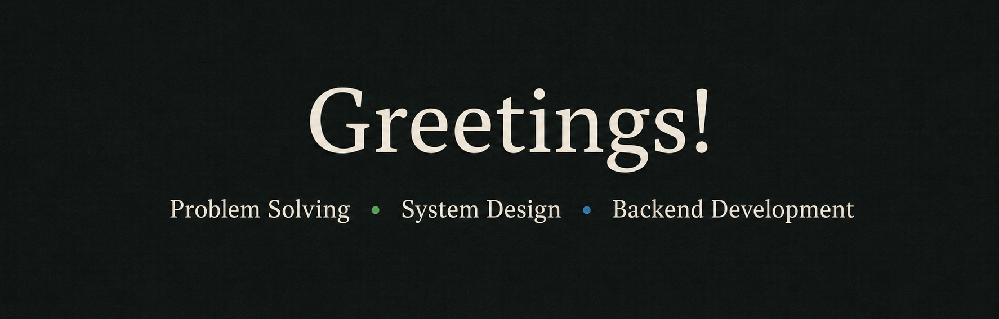

 

### **I’m learning through open source and building projects inspired by what I discover.**

**I use first-principles thinking to break down problems, connect knowledge, and understand how things work from the ground up.**

 

## **Skills & Tools**

<table>
<tr>
<td width="50%" valign="top">

### **Languages**

**Go** · **C++** · **Python**

</td>
<td width="50%" valign="top">

### **Backend**

**Go** · **Gin** · **PostgreSQL**

</td>
</tr>

<tr>
<td width="50%" valign="top">

### **Systems**

**Linux** · **Bash**

</td>
<td width="50%" valign="top">

### **Testing**

**Go Testing** · **Postman**

</td>
</tr>

<tr>
<td width="50%" valign="top">

### **Production & Infrastructure**

**Docker** · **Kubernetes** · **Git** · **GitHub** · **OpenTelemetry**

</td>
<td width="50%" valign="top">

### **Currently Exploring**

**Distributed Systems** · **Observability** · **System Design**

</td>
</tr>
</table>

 

**Learn · Build · Contribute · Grow**

